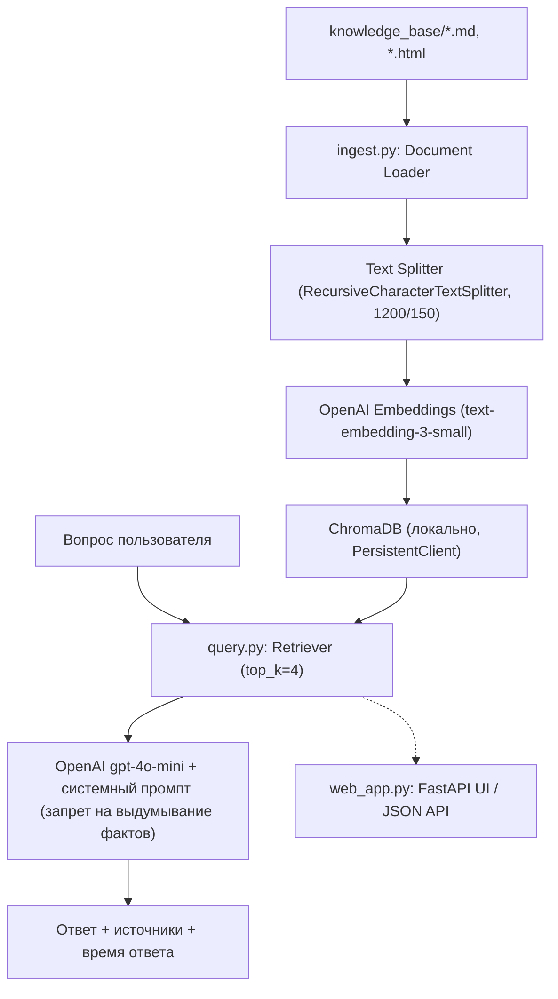
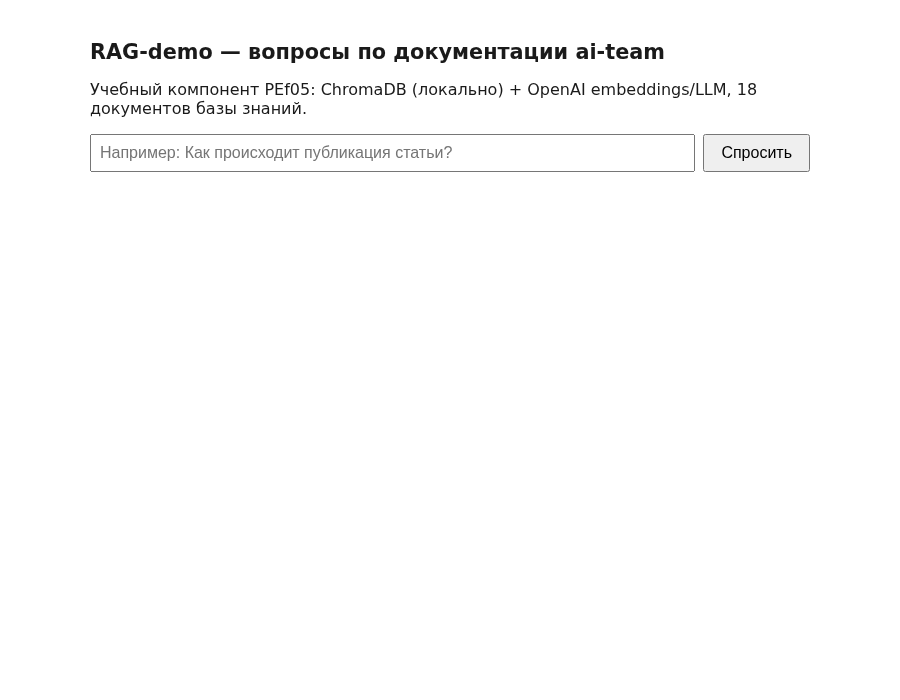
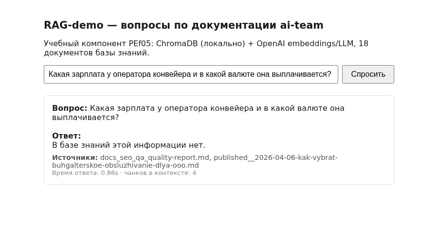

# RAG Assistant

Локальный RAG (Retrieval-Augmented Generation) ассистент: задаёте вопрос по документации — получаете ответ с указанием источника, а не выдумку по памяти модели. CLI и веб-интерфейс на FastAPI поверх одного и того же ядра.

## Описание

Полный цикл RAG «под капотом», без магии фреймворков: загрузка документов → чанкинг → эмбеддинги → векторный поиск → генерация ответа с честным отказом, если в базе знаний ответа нет. Изначально построен и протестирован на 18 реальных технических документах (в рамках учебного проекта), в этой версии база знаний заменена на публичные README открытых репозиториев автора — чтобы демо можно было запустить и проверить, не имея доступа к внутренним данным.

## Возможности

- Индексация `.md` и `.html` документов из папки `knowledge_base/`
- Умный чанкинг с разбиением по заголовкам/абзацам (`RecursiveCharacterTextSplitter`, 1200/150)
- Векторный поиск по косинусному расстоянию (ChromaDB, локально, без внешнего сервиса)
- Ответ с указанием источников и честным «в базе знаний этой информации нет», если контекст не релевантен
- CLI (`query.py`) и веб-интерфейс (`web_app.py`, FastAPI) поверх одного и того же кода — retrieval/LLM-логика не дублируется
- JSON-режим для интеграции в скрипты/тесты

## Архитектура



## Стек

Python 3.11+, OpenAI API (`text-embedding-3-small`, `gpt-4o-mini`), ChromaDB, `langchain-text-splitters`, BeautifulSoup4, FastAPI, uvicorn

## Быстрый запуск

```bash
git clone <repo-url> rag-assistant && cd rag-assistant
pip install -r requirements.txt
cp .env.example .env        # вписать свой OPENAI_API_KEY

python3 ingest.py           # один раз — строит векторную БД из knowledge_base/
python3 query.py "О чём этот проект?"
```

### Веб-интерфейс

```bash
uvicorn web_app:app --host 127.0.0.1 --port 8901
# затем открыть http://127.0.0.1:8901
```

### Docker

```bash
docker compose build
docker compose run --rm rag-assistant python3 ingest.py   # один раз — строит векторную БД
docker compose up
```

## Пример использования

```bash
$ python3 query.py "Как устроена память агента в jarvis-telegram-gateway?"

Вопрос: Как устроена память агента в jarvis-telegram-gateway?

Ответ:
Память построена по многоуровневой схеме hot/warm/cold: HOT — сырой журнал
последних 24–72 часов, WARM — дистиллированные решения за 14 дней, COLD —
постоянный архив. Сжатие выполняется по расписанию отдельным вызовом модели...

Источники: jarvis-telegram-gateway.md
Время ответа: 2.1s
```

> Пример иллюстративный — реальный ответ зависит от содержимого `knowledge_base/` на момент запуска `ingest.py`.

## Скриншоты





> Скриншот с полным примером ответа на текущей (публичной) базе знаний ещё не сделан — прежний скриншот был снят на другой, непубличной базе знаний и не подходит для этой версии репозитория. Снимается одной командой после `python3 ingest.py` + переход на `/ask?q=...`.

## Roadmap

- [ ] Добавить оценку качества ответов через RAGAS (Faithfulness, Context Precision)
- [ ] Поддержка альтернативных эмбеддингов (локально, через Ollama) — без обязательного платного API
- [ ] Гибридный поиск (dense + sparse/BM25)
- [ ] Docker-образ с предзагруженной `chroma_db/` для demo без API-ключа на старте

## Лицензия

MIT — см. [LICENSE](LICENSE)
